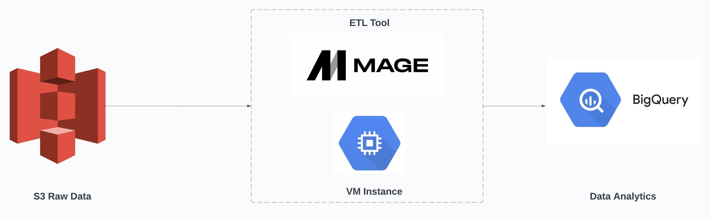
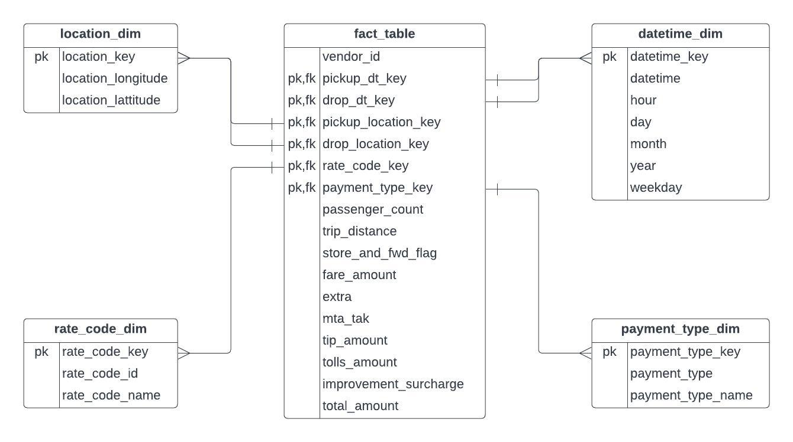

# taxi-data-engineering

## Introduction

The goal of this project is to perform data engineering on taxi data by creating a data model and performing data ETL using various tools and technologies, including AWS S3 for storage, Python, Compute Instance, Mage Data Pipeline Tool and BigQuery.

## Architecture 

## Technology Used
- Programming Language - Python

1. Compute Instance 
2. BigQuery
3. S3

Modern Data Pipeine Tool - https://www.mage.ai/

## Dataset Used
TLC Trip Record Data
Yellow and green taxi trip records include fields capturing pick-up and drop-off dates/times, pick-up and drop-off locations, trip distances, itemized fares, rate types, payment types, and driver-reported passenger counts. 

Here is the dataset used: https://github.com/HassanAlIdroos/taxi-data-engineering/blob/main/Data/taxi_data.csv

More info about dataset can be found here:
1. Website - https://www.nyc.gov/site/tlc/about/tlc-trip-record-data.page
2. Data Dictionary - https://www.nyc.gov/assets/tlc/downloads/pdf/data_dictionary_trip_records_yellow.pdf

## Data Model

